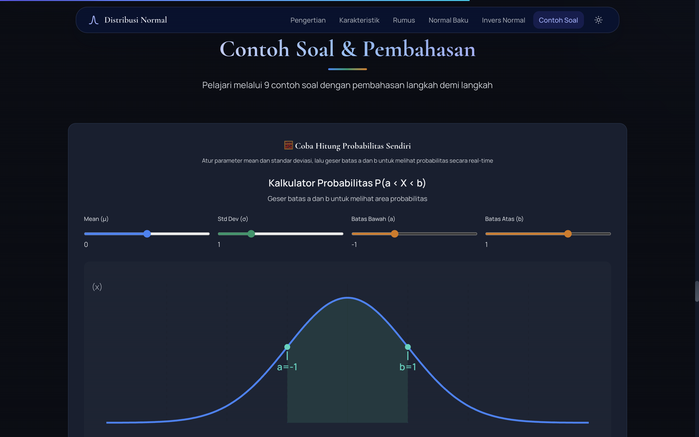
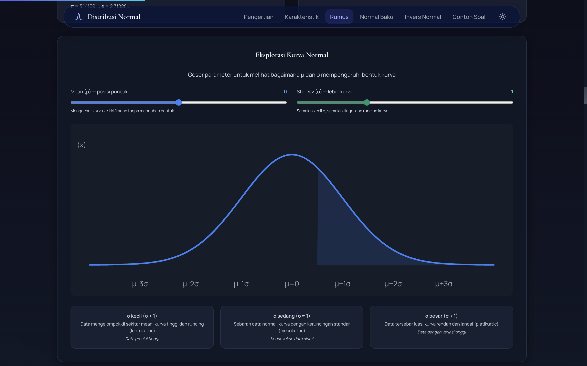
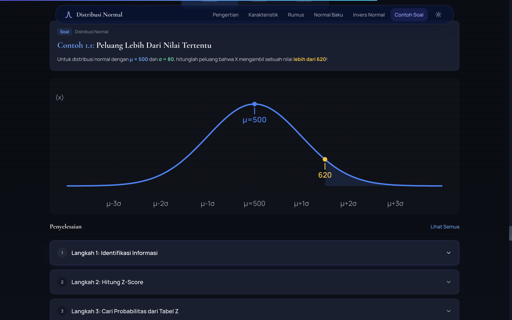

# σ Distribusi Normal — Pembelajaran Interaktif

[](https://web-penprob.vercel.app)
[](https://react.dev)
[](https://www.typescriptlang.org)
[](https://vitejs.dev)
[](https://tailwindcss.com)

> Website pembelajaran interaktif untuk memahami konsep distribusi normal, distribusi normal baku, dan invers normal baku dalam statistika.

**Dibuat untuk memenuhi tugas proyek mata kuliah Pengantar Probabilitas, Prodi Statistika, Kelas B**


---

## Fitur Utama

### Konten Pembelajaran

- **Pengertian Distribusi Normal** — Sejarah, definisi, dan 6 sifat kurva normal
- **Karakteristik** — Mean, variansi, deviasi standar, aturan empiris (68-95-99.7%)
- **Rumus (PDF & CDF)** — Fungsi densitas probabilitas dan fungsi distribusi kumulatif
- **Distribusi Normal Baku** — Standardisasi Z-score dan tabel Z lengkap
- **Invers Normal Baku** — Fungsi kuantil dan nilai kritis

### Kalkulator Interaktif

- **Z-Score Calculator** — Hitung Z-score dan probabilitas secara real-time
- **Inverse Normal Calculator** — Cari Z dari probabilitas kumulatif
- **Probability Slider** — Visualisasi probabilitas dengan slider interaktif



### Visualisasi

- Kurva normal animasi (SVG + Framer Motion)
- Area probabilitas yang diarsir
- Grid referensi σ (±1σ, ±2σ, ±3σ)



### Latihan

- 9 contoh soal lengkap dengan pembahasan langkah demi langkah
- 4 soal latihan untuk uji pemahaman
- Semua menggunakan notasi LaTeX (KaTeX)



---

## Tech Stack

| Teknologi | Kegunaan |
|-----------|----------|
| [React 19](https://react.dev) | UI Framework |
| [TypeScript](https://www.typescriptlang.org) | Type Safety |
| [Vite 6](https://vitejs.dev) | Build Tool |
| [Tailwind CSS 4](https://tailwindcss.com) | Styling |
| [Framer Motion](https://www.framer.com/motion/) | Animasi |
| [KaTeX](https://katex.org) | Render Rumus Matematika |
| [Lucide React](https://lucide.dev) | Ikon |

---

## Cara Menjalankan

```bash
# Clone repository
git clone https://github.com/Ixvaran/web-penprob.git
cd web-penprob/distribusi-normal

# Install dependencies
npm install

# Jalankan development server
npm run dev

# Build untuk production
npm run build
```

---

## Kontributor

| Nama |
|------|
| Fahlig Aryo Jenar Maheswara |
| Muhammad Farhan Fauzul Adzim |
| Priyamitha Aristadewi |
| Virziankha Merdeka Darwanto |

---

## Daftar Pustaka

1. Walpole, R. E., Myers, R. H., Myers, S. L., & Ye, K. (1993). *Probability and Statistics for Engineers and Scientists* (Vol. 5, pp. 326–332). New York: Macmillan.
2. Pratikno, A. S., Prastiwi, A. A., & Ramahwati, S. (2020). Sebaran peluang acak kontinu, distribusi normal, distribusi normal baku, distribusi T, distribusi Chi Square, dan distribusi F. *Osf Preprints*, 27(3), 1–5.

---

## 📄 Lisensi

Proyek ini dibuat untuk keperluan akademis.
